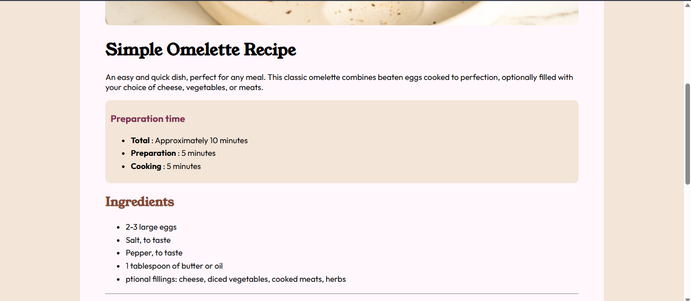

# Frontend Mentor - Recipe page solution

This is a solution to the [Recipe page challenge on Frontend Mentor](https://www.frontendmentor.io/challenges/recipe-page-KiTsR8QQKm). Frontend Mentor challenges help you improve your coding skills by building realistic projects. 

## Overview
Overall, looking back, I did fairly well, and got in a lot of practice along the way.
### Screenshot

### Links

- Live Site URL: [https://recipe-page-sonicx180.vercel.app/](https://recipe-page-sonicx180.vercel.app/)

## My process
Started with applying html elements to everything, then styled
### Built with

- Semantic HTML5 markup
- CSS custom properties

### What I learned
I continued to apply the css skills I've learned in the past, and learned a few new things about the structure of my page

## Acknowledgments

[Clement Roze](https://clementroze.com)

He helped me with a few things along the way, shoutout to him
